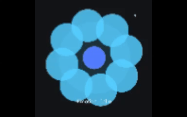

# 🌿 Digital Garden: Breathing Emotions

> 🎨 *An interactive generative art project that visualizes emotions through rhythm, color, and motion.*

---

## 📖 Table of Contents
- [Overview](#overview)
- [Concept](#concept)
- [Features](#features)
- [Preview](#preview)
- [Installation & Run](#installation--run)
- [Controls](#controls)
- [Project Structure](#project-structure)
- [Code Example](#code-example)
- [References](#references)
- [Author](#author)
- [License](#license)

---

## 🪷 Overview
**Digital Garden: Breathing Emotions** is an interactive artwork built with **Processing (Python Mode)** for the  
*52685 Working with Data and Code* subject at the **University of Technology Sydney (UTS)**.

It visualizes emotional states through a breathing digital flower that expands and contracts in rhythm,  
changing its color to represent different emotional states:

| Emotion | Colour |
|----------|---------|
| 🩵 Calm | Blue |
| 💛 Happy | Yellow |
| ❤️ Stress | Red |
| 💜 Sad | Purple |

---

## 💡 Concept
This generative art prototype explores how code can express *emotion* through **motion**, **timing**, and **interaction**.  
The flower’s rhythm symbolizes breathing — a natural motion that conveys calmness and emotion through algorithmic flow.  

It draws inspiration from **Daniel Shiffman’s** *The Nature of Code (Chapter 3: Oscillation)*  
and explores how mathematical logic (e.g., sine waves, easing functions) can simulate organic empathy.

---

## ✨ Features
✔️ Smooth breathing motion based on `sin()` and `millis()` functions  
✔️ Gradual color transitions between emotional states using `lerpColor()`  
✔️ Interactive controls to change emotion and breathing speed  
✔️ Rotating animation with optional toggle (`R` key)  
✔️ On-screen HUD showing current emotion and pulse speed  

---

## 🎥 Preview
| Calm | Stress |
|------|---------|
|  |  |

> *The flower breathes and changes color in response to user input.*

---

## ⚙️ Installation & Run
### Requirements
- **Processing (Python Mode)** → [Download here](https://py.processing.org/download/)

---

## How to Run
1. Open **Processing** and switch to **Python Mode**.  
2. Download this repository or clone it using Git.  
3. Open `Digital_Emotion_Garden.pyde` (or `sketch.pyde`) in Processing.  
4. Click **Run ▶** to start the animation.

### Controls
| Key | Function |
|-----|-----------|
| **A / D** | Slow down / Speed up the flower’s inner pulse |
| **1 – 4** | Switch between emotional themes *(Calm, Happy, Stress, Sad)* |
| **R** | Toggle rotation on/off |

---

## Code Overview
- **setup()** — Initializes the canvas, color mode, and starting emotion.  
- **draw()** — Handles time-based animation, easing, and color interpolation.  
- **keyPressed()** — Enables interactive control of emotion, speed, and rotation.  
- **set_emotion()** — Switches between color palettes and initiates smooth transitions.  
- **Global Variables** — Manage breathing cycle (`period`), pulse speed, color states, and rotation.  

The code demonstrates key programming concepts:
- Variables and constants for state management  
- Functions for modular structure and reusability  
- Loops for drawing repeating petals  
- Trigonometric functions for generative motion  
- User input handling for interactivity  

---

## Project Status
Project is: complete 

---

## References

Shiffman, D. (2012). The Nature of Code: Simulating Natural Systems with Processing. https://natureofcode.com/book

Processing Foundation. (n.d.). Processing reference. https://processing.org/reference

Processing Foundation. (n.d.). Processing.py reference. https://py.processing.org/reference/

---

## Author

Luofei Wang (25239575)
52685 Working with Data and Code – University of Technology Sydney
